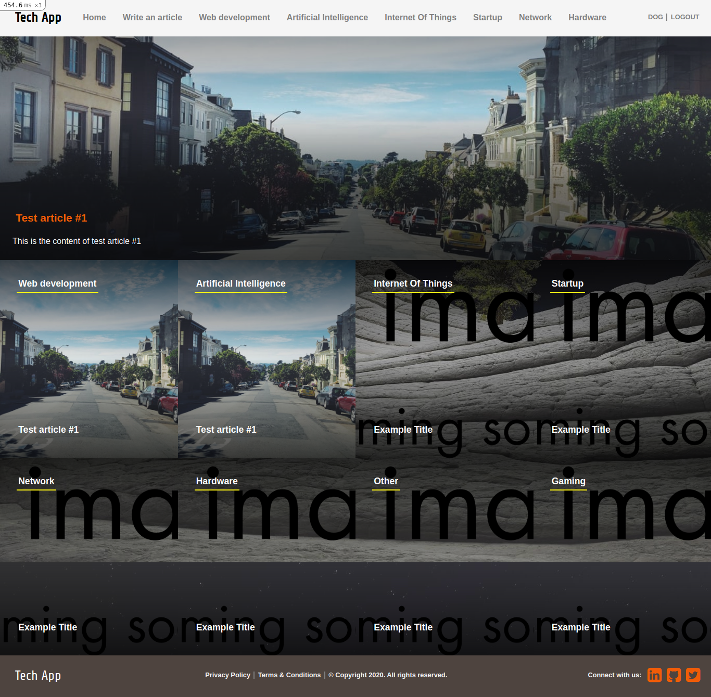

# Tech App

> Tech App is the most popular web app to write - read articles about the latest Netflix shows. Simply log in to your account and start exploring.  This project consists of a simple session system with login and sign-up functionalities. You'll be redirected to the homepage where all categories will be displayed together with the most recent article written in that category. You can click the category section to browse all articles inside a single category. I also implemented a voting system for the articles where the user can vote just once for each article.

## Features

- User can log in only using the username
- User sees the homepage where the first row is the most voted article followed by all categories - listed with the most recent article's image and title
- Only logged in user can submit an article
- When the user clicks on a category inside the homepage, they can see all articles in that category
- Users can vote only once for each article.

## Built With

- Ruby v2.7.2
- Ruby on Rails v6.1.3.1

## Live Demo

[Live demo](https://arcane-crag-22572.herokuapp.com/categories)

### Screenshot of the homepage
https://arcane-crag-22572.herokuapp.com/categories

## Getting Started

To get a local copy up and running follow these simple example steps:

- Open your terminal
- Clone this project into the directory of your choice `git clone https://github.com/Ralph-1/lifestyle-article.git`
- Go to the project folder `cd lifestle-articles`

### Install

- Run `bundle install`
- Run `yarn install`
- Create the database `rails db:create` 
- Migrate the database `rails db:migrate`
- Seed it `rails db:seed`

If you want to populate the database with some text and images run this task:
- `rails db:populate`

- Run `rails s` or `rails server`

- To run tests, Run `rspec` in the project root directory

👤 **Ralph**

- GitHub: [Ralph-1](https://github.com/Ralph-1)
- LinkedIn: [Ralph](https://www.linkedin.com/in/ralph-oburu/)
- Twitter: [@NotRalph0](https://twitter.com/NotRalph0)

## Credits

Thanks to [Nelson Sakwa](https://www.behance.net/sakwadesignstudio) for her awesome design work. I based my work on  [this](https://www.behance.net/gallery/14554909/liFEsTlye-Mobile-version) design.

## 🤝 Contributing

Contributions, issues, and feature requests are welcome!
Feel free to check the [issues page](https://github.com/Ralph-1/lifestyle-article/issues).

